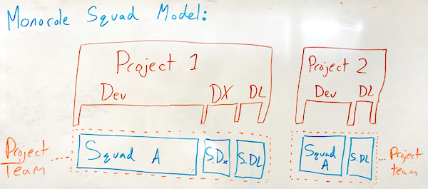
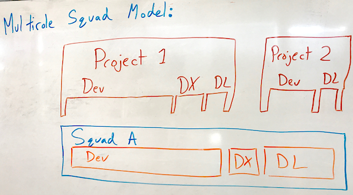

Squad Composition
=================

The team model is functional independent of how squads are composed. However, determining squad composition does affect how projects are allocated to the Squad. Here's why:

Projects typically have role requirements: the project has need for X developers, Y DX, and Z DL.

There are two principal ways a Squad can be organized: monorole and multirole.

Monorole Squads
---------------

A monorole squad is a squad that is composed entirely of one role. This way of organization has a number of notable properties; some advantages, some disadvantages.

 - When working with monorole squads, every project will be a collaboration between squads, forming a project team. This requires the Strategist to be aware of specific project needs.
 - Squad Captains can very easily rotate squad members
 - Starting a project will have some friction as the squads learn to collaborate
 - Roles that tend to be minorities for a project (DL, DX) will have more tailored support from their squad

Multirole Squads
----------------

A multirole squad is a squad that is composed of multiple roles, proportioned to typical project requirements. Advantages, disadvantages include:

 - one squad can fulfill all needs of a project; the Strategist should only be aware of overall capacity.
 - Squads will sometimes need additional minority role capacity: for example, more than one DL in order to manage multiple projects
 - Squad Captains must be sensitive to the needs of all roles represented on the squad
 - when a squad is assigned a project that has unusual role requirements (needs more DX than dev, for example), it may face growth problems within the role inside the squad
 - Delivery and DX will be better normed to the dev team, no friction on project start
 - Rotation of minority roles from one squad to another causes friction
 - squad Elasticity will not be representative of growing minority roles
 
 